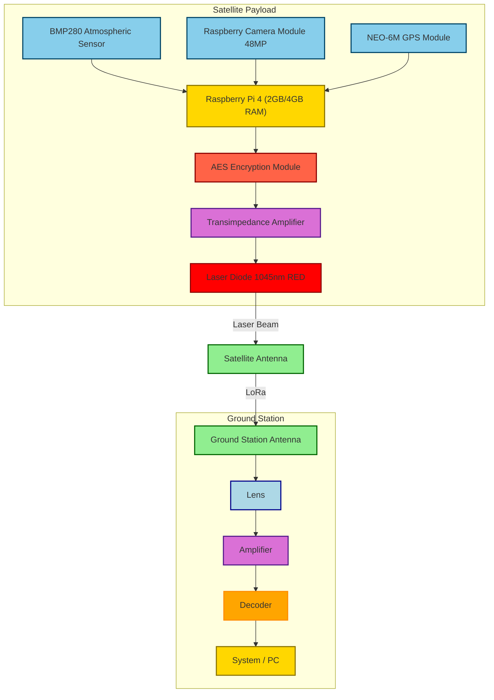

# Satellite Communication Project

## Overview
This project aims to establish secure communication between a satellite and a ground station using encryption and blockchain technology.

## Directory Structure
- **/keys**: Contains RSA key pairs for the satellite and ground station.
- **/encryption**: Encryption logic using RSA and AES.
- **/blockchain**: Implements a basic blockchain to log commands.
- **/contracts**: Smart contracts for managing satellite commands.
- **/scripts**: Scripts for the satellite and ground station.
- **/data**: Telemetry data in JSON format.

## Installation
To install the required packages, run:
```bash
pip install -r requirements.txt
```

```bash
sudo apt update
sudo apt install nodejs npm
sudo npm install -g truffle
npm install -g ganache-cli
```
## Usage
### Ground Station
```bash
truffle init
truffle compile
truffle migrate
truffle deploy
```

```bash
truffle console --network development
```

# Satellite Model :


# Satellite Equipment
The satellite is designed to integrate advanced communication technologies, including laser communication for high-speed data transfer. 
Key components include:
- **Raspberry Pi 4** :Acts as the processing unit for managing communication protocols and controlling the onboard laser systems.

- **Camera Module (48MP)**: Captures high-resolution images and transmits them to Earth using laser communication.

- **Laser Diode (650nm, 5mW)**: Serves as the primary communication channel, transmitting data in the form of light beams.

- **Photodetector**: Used to receive light signals for two-way communication or testing.

- **Transimpedance Amplifier**: Converts light signals into electrical signals for data processing.

- **Lens System**: Focuses and optimizes the laser beam for long-distance transmission.

- **Power System**: Solar panels and batteries supply energy to all components onboard.

- **Collision Avoidance System**: Ensures safe operation in crowded orbital regions.


# Architecture Diagram :




# Laser Communication Details
- **Operating Wavelength**: 650nm (visible red laser), suitable for short-to-medium-range communication.
- **Data Transfer Rate**: Offers much higher speeds compared to traditional RF communication, capable of gigabit-level transfer rates.
- **Beam Precision**: Laser communication ensures highly focused beams, reducing interference and improving bandwidth utilization.
  
## **Advantages**:
  
- Low latency and high-speed transmission.
- High security due to narrow beam divergence.
- Reduced risk of signal interception.
  
## **Challenges**:

- Performance may be affected by weather conditions like rain, clouds, or atmospheric turbulence.
- Requires precise alignment between the satellite and ground station.

# Satellite hardware Demo 


# Communication Architecture Diagram :


# Ground station architecture Diagram :


## Laser Equipment
- **Laser Diode Module**: A 5mW, 650nm red laser serves as the primary transmitter for optical communication.
- **Laser Driver Circuit (LM317)**: Provides stable current to the laser diode for efficient operation.
- **Lens System**: Enhances the beam’s focus and range. Can use Fresnel or aspheric lenses for cost-efficiency.
- **Photodetector (Light-Dependent Resistor)**: Detects incoming laser signals for testing or two-way communication.
- **Transimpedance Amplifier**: Amplifies weak signals received from the photodetector.
- **Safety Measures**: Laser safety goggles and secure mounts to avoid beam misdirection or damage.

## Ground Station Equipment
The ground station will track and communicate with the satellite, featuring the following components:

- **Laser Receiver Module**: Includes a photodetector and amplifier to capture laser signals.
- **Telescope System**: Tracks and focuses on the satellite's laser beam for precise alignment.
- **Motorized Mount/Tripod**: Adjusts the receiver's position to maintain alignment with the satellite’s orbit.
- **Raspberry Pi with ADC (MCP3008)**: Processes incoming signals, converts analog signals to digital, and interfaces with the control systems.
- **Communication Software**: Handles decoding, error correction, and data visualization.
- **Power System**: Uninterruptible power supply (UPS) to ensure consistent operation.
- **Weather Monitoring System**: Detects adverse weather conditions like clouds or rain that may affect laser communication.

# Demo Satellite Architecture


# AOC Architecture 


